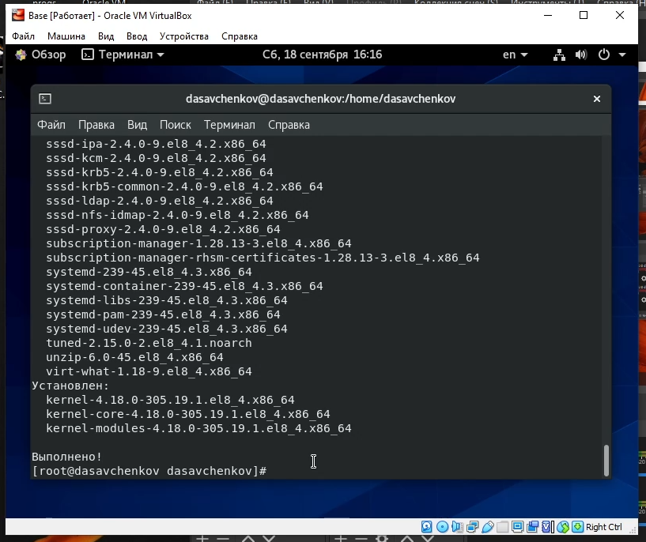
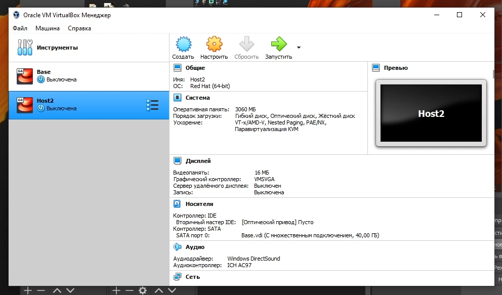

---
# Front matter
title: "Отчет по лабораторной работе 1"
subtitle: "Дисциплина: Информационная безопасность"
author: "Савченков Д.А., НПИбд-02-18"

# Generic otions
lang: ru-RU
toc-title: "Содержание"

# Bibliography
bibliography: bib/cite.bib
csl: pandoc/csl/gost-r-7-0-5-2008-numeric.csl

# Pdf output format
toc: true # Table of contents
toc_depth: 2
lof: true # List of figures
lot: true # List of tables
fontsize: 12pt
linestretch: 1.5
papersize: a4
documentclass: scrreprt
## I18n
polyglossia-lang:
  name: russian
  options:
	- spelling=modern
	- babelshorthands=true
polyglossia-otherlangs:
  name: english
### Fonts
mainfont: PT Serif
romanfont: PT Serif
sansfont: PT Sans
monofont: PT Mono
mainfontoptions: Ligatures=TeX
romanfontoptions: Ligatures=TeX
sansfontoptions: Ligatures=TeX,Scale=MatchLowercase
monofontoptions: Scale=MatchLowercase,Scale=0.9
## Biblatex
biblatex: true
biblio-style: "gost-numeric"
biblatexoptions:
  - parentracker=true
  - backend=biber
  - hyperref=auto
  - language=auto
  - autolang=other*
  - citestyle=gost-numeric
## Misc options
indent: true
header-includes:
  - \linepenalty=10 # the penalty added to the badness of each line within a paragraph (no associated penalty node) Increasing the value makes tex try to have fewer lines in the paragraph.
  - \interlinepenalty=0 # value of the penalty (node) added after each line of a paragraph.
  - \hyphenpenalty=50 # the penalty for line breaking at an automatically inserted hyphen
  - \exhyphenpenalty=50 # the penalty for line breaking at an explicit hyphen
  - \binoppenalty=700 # the penalty for breaking a line at a binary operator
  - \relpenalty=500 # the penalty for breaking a line at a relation
  - \clubpenalty=150 # extra penalty for breaking after first line of a paragraph
  - \widowpenalty=150 # extra penalty for breaking before last line of a paragraph
  - \displaywidowpenalty=50 # extra penalty for breaking before last line before a display math
  - \brokenpenalty=100 # extra penalty for page breaking after a hyphenated line
  - \predisplaypenalty=10000 # penalty for breaking before a display
  - \postdisplaypenalty=0 # penalty for breaking after a display
  - \floatingpenalty = 20000 # penalty for splitting an insertion (can only be split footnote in standard LaTeX)
  - \raggedbottom # or \flushbottom
  - \usepackage{float} # keep figures where there are in the text
  - \floatplacement{figure}{H} # keep figures where there are in the text
---

# Цель работы

Приобретение практических навыков установки операционной системы на виртуальную машину, настройки минимально необходимых для дальнейшей работы сервисов.

# Задание

Лабораторная работа подразумевает установку на виртуальную машину VirtualBox операционной системы Linux, дистрибутив Centos.

# Теоретическое введение

Установка

# Выполнение лабораторной работы

1. Загрузил на своем компьютере операционную систему Windows. Осуществил вход в систему.

2. Перешел в каталог, предназначенный для данного предмета.

3. Создал каталог с именем пользователя dasavchenkov.

4. Перешел в каталог "Загрузки", где размещён образ виртуальной машины.

5. Скопировал образ виртуальной машины в созданный на предыдущем шаге каталог (рис. [-@fig:001]).

{ #fig:001 width=70% }

6. Запустил виртуальную машину (рис. [-@fig:002]).

{ #fig:002 width=70% }

7. Проверил в свойствах VirtualBox месторасположение каталога для виртуальных машин. Для этого в VirtualBox выбрал "Файл" -> "Свойства", вкладка "Общие". 
В поле "Папка для машин" (рис. [-@fig:003]) должен стоять каталог dasavchenkov, расположенный в папке ИБ.

{ #fig:003 width=70% }

8. Создал новую виртуальную машину. Для этого в VirtualBox выбрал "Машина" -> "Создать". Указал имя виртуальной машины — Base, тип операционной системы — 
Linux, RedHat. Указал размер основной памяти виртуальной машины — 3060 МБ. Также создал новый виртуальный жесткий диск. (рис. [-@fig:004])

{ #fig:004 width=70% }

9. Задал конфигурацию жесткого диска — загрузочный, VDI (VirtualBox Disk Image), динамический виртуальный диск. Задал размер диска — 40 ГБ и его 
расположение. (рис. [-@fig:005])

{ #fig:005 width=70% }

10. В VirtualBox появилась новая виртуальная машина (рис. [-@fig:006]).

{ #fig:006 width=70% }

11. Выделил в окне менеджера VirtualBox виртуальную машину Base и открыла окно "Свойства". Проверила, что папка для снимков виртуальной машины Base имеет 
путь <Моя папка>/Base/Snapshots. Для этого выбрал в VirtualBox "Свойства" виртуальной машины Base -> "Общие", вкладка "Дополнительно" (рис. [-@fig:007]).

{ #fig:007 width=70% }

12. Выбрал в VirtualBox "Свойства" -> "Носители" виртуальной машины Base. Добавил новый привод оптических дисков и выбрал нужный образ (рис. [-@fig:008] 
и [-@fig:009]).

{ #fig:008 width=70% }

{ #fig:009 width=70% }

13. Запустил виртуальную машину Base, выбрал установку системы (рис. [-@fig:010]).

{ #fig:010 width=70% }

14. Установил русский язык по умолчанию (рис. [-@fig:011]).

{ #fig:011 width=70% } 

15. В качестве имени машины указал «dasavchenkov.localdomain» (рис. [-@fig:014]).

{ #fig:014 width=70% }

16. Указал часовой пояс «Москва» (рис. [-@fig:015]).

{ #fig:015 width=70% }

17. Установил пароль для root (рис. [-@fig:016]).

{ #fig:016 width=70% }

18. Создал пользователя dasavchenkov (рис. [-@fig:018]).

{ #fig:018 width=70% }

19. Проверил все пункты и начал установку (рис. [-@fig:019]).

{ #fig:019 width=70% }

20. Завершил установку операционной системы и перезагрузил её (рис. [-@fig:020]).

{ #fig:020 width=70% }

21. В VirtualBox оптический диск отключился автоматически (рис. [-@fig:021]).

{ #fig:021 width=70% }

22. Запустил виртуальную машину. Приняла лицензию (рис. [-@fig:022]).

{ #fig:022 width=70% }

23. Подключилась к виртуальной машине с помощью созданной учётной записи (рис. [-@fig:023]).

{ #fig:023 width=70% }

24. Настроил все, что требовалось (рис. [-@fig:024] и [-@fig:025]).

{ #fig:024 width=70% }

{ #fig:025 width=70% }

25. На виртуальной машине Base запустил терминал, перешел под учетную запись root с помощью команды su (рис. [-@fig:026]). С помощью команды yum update 
обновил системные файлы. (рис. [-@fig:026] и [-@fig:027])

{ #fig:026 width=70% }

{ #fig:027 width=70% }

26. Установил необходимые программы (mc) (рис. [-@fig:028] и [-@fig:029]).

{ #fig:028 width=70% }

{ #fig:029 width=70% }

27. После установки необходимых программ завершил работу виртуальной машины.

28. Для того чтобы другие виртуальные машины могли использовать машину Base и её конфигурацию как базовую, произвел следующие действия. В VirtualBox в меню 
выбрала "Файл" -> "Менеджер виртуальных носителей" -> "Жёсткие диски" и, выделив «Base.dvi», указала "Отключить". (рис. [-@fig:030] и [-@fig:031])

{ #fig:030 width=70% }

{ #fig:031 width=70% }

29. На основе виртуальной машины Base создал машину Host2, выбрав в VirtualBox "Машина" -> "Создать" и в "Мастере создания новой виртуальной машины" указав 
в качестве имени машины Host2, в качестве типа операционной системы — Linux, версия RedHat, а при конфигурации виртуального жёсткого диска выбрав 
"Использовать существующий жёсткий диск" Base.vdi. (рис. [-@fig:032] и [-@fig:033])

{ #fig:032 width=70% }

{ #fig:033 width=70% }

# Выводы

Приобрел практические навыки установки операционной системы на виртуальную машину, настройки минимально необходимых для дальнейшей работы сервисов.

# Список литературы{.unnumbered}

1. Кулябов Д. С., Королькова А. В., Геворкян М. Н. Информационная безопасность компьютерных сетей. Лабораторная работа № 1. Установка и конфигурация 
операционной системы на виртуальную машину