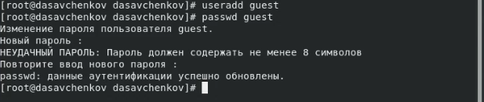
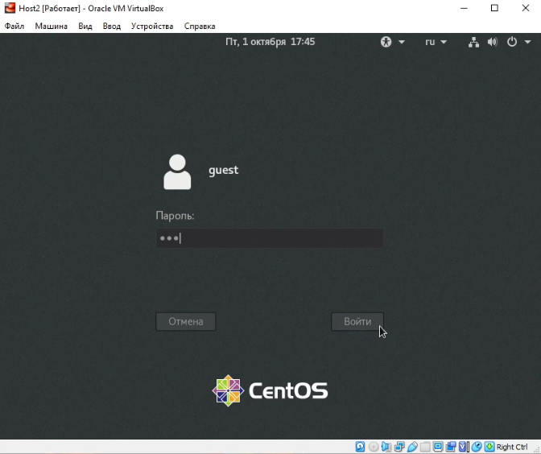
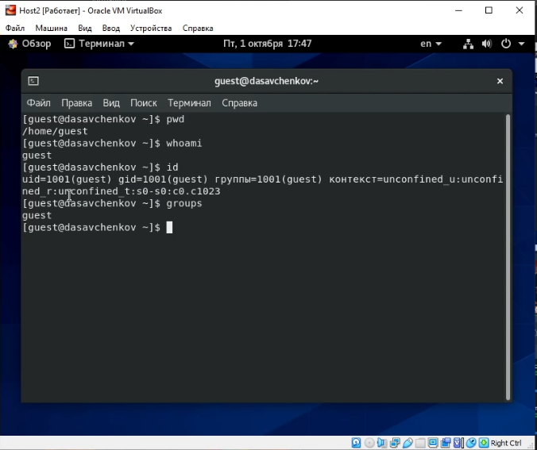
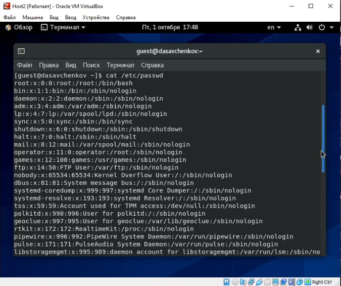
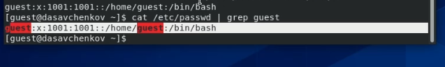
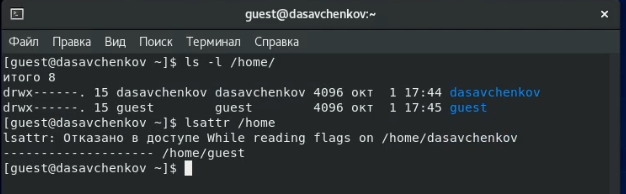
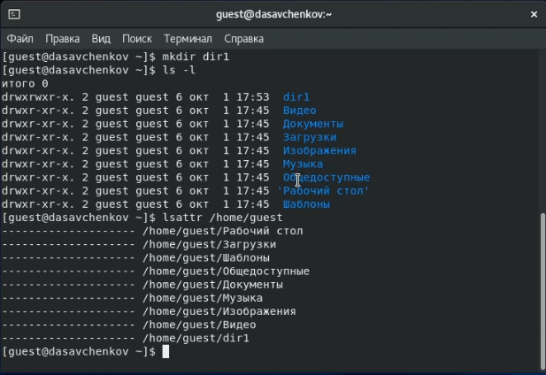
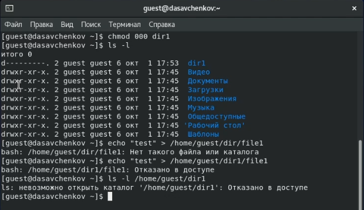

---
# Front matter
title: "Отчет по лабораторной работе 2"
subtitle: "Дисциплина: Информационная безопасность"
author: "Савченков Д.А., НПИбд-02-18"

# Generic otions
lang: ru-RU
toc-title: "Содержание"

# Bibliography
bibliography: bib/cite.bib
csl: pandoc/csl/gost-r-7-0-5-2008-numeric.csl

# Pdf output format
toc: true # Table of contents
toc_depth: 2
lof: true # List of figures
lot: true # List of tables
fontsize: 12pt
linestretch: 1.5
papersize: a4
documentclass: scrreprt
## I18n
polyglossia-lang:
  name: russian
  options:
	- spelling=modern
	- babelshorthands=true
polyglossia-otherlangs:
  name: english
### Fonts
mainfont: PT Serif
romanfont: PT Serif
sansfont: PT Sans
monofont: PT Mono
mainfontoptions: Ligatures=TeX
romanfontoptions: Ligatures=TeX
sansfontoptions: Ligatures=TeX,Scale=MatchLowercase
monofontoptions: Scale=MatchLowercase,Scale=0.9
## Biblatex
biblatex: true
biblio-style: "gost-numeric"
biblatexoptions:
  - parentracker=true
  - backend=biber
  - hyperref=auto
  - language=auto
  - autolang=other*
  - citestyle=gost-numeric
## Misc options
indent: true
header-includes:
  - \linepenalty=10 # the penalty added to the badness of each line within a paragraph (no associated penalty node) Increasing the value makes tex try to have fewer lines in the paragraph.
  - \interlinepenalty=0 # value of the penalty (node) added after each line of a paragraph.
  - \hyphenpenalty=50 # the penalty for line breaking at an automatically inserted hyphen
  - \exhyphenpenalty=50 # the penalty for line breaking at an explicit hyphen
  - \binoppenalty=700 # the penalty for breaking a line at a binary operator
  - \relpenalty=500 # the penalty for breaking a line at a relation
  - \clubpenalty=150 # extra penalty for breaking after first line of a paragraph
  - \widowpenalty=150 # extra penalty for breaking before last line of a paragraph
  - \displaywidowpenalty=50 # extra penalty for breaking before last line before a display math
  - \brokenpenalty=100 # extra penalty for page breaking after a hyphenated line
  - \predisplaypenalty=10000 # penalty for breaking before a display
  - \postdisplaypenalty=0 # penalty for breaking after a display
  - \floatingpenalty = 20000 # penalty for splitting an insertion (can only be split footnote in standard LaTeX)
  - \raggedbottom # or \flushbottom
  - \usepackage{float} # keep figures where there are in the text
  - \floatplacement{figure}{H} # keep figures where there are in the text
---

# Цель работы

Получение практических навыков работы в консоли с атрибутами файлов, закрепление теоретических основ дискреционного разграничения доступа в современных 
системах с открытым кодом на базе ОС Linux.

# Выполнение лабораторной работы

1. В установленной при выполнении предыдущей лабораторной работы операционной системе создал учётную запись пользователя guest (используя учётную запись 
администратора): useradd guest. (рис. [-@fig:001])

2. Задал пароль для пользователя guest (используя учётную запись администратора): passwd guest. (рис. [-@fig:001])

{ #fig:001 width=70% }

3. Вошел в систему от имени пользователя guest. (рис. [-@fig:002])

{ #fig:002 width=70% }

4. Определил директорию, в которой я нахожусь, командой *pwd*. (рис. [-@fig:003]) Это моя домашняя директория. Она в целом совпадает с приглашением командной 
строки: в командной строке есть guest (пользователь) и ~ (указывает на то, что мы находимя в домашней директории).

5. Уточнил имя моего пользователя командой whoami. (рис. [-@fig:003])

6. Уточнил имя моего пользователя, его группу, а также группы, куда он входит, командой *id*. (рис. [-@fig:003]) Выведенные значения uid, gid и др. 
запомнил. Выполнил команду *groups*. (рис. [-@fig:003]) Полученные значения совпадают с тем, что выдала *id*.

{ #fig:003 width=70% }

7. Полученная информация об имени пользователя частично совпадает (само имя пользователя) с данными, выводимыми в приглашении командной строки, но является 
более подробной.

8. Просмотрел файл /etc/passwd: cat /etc/passwd. (рис. [-@fig:004]) 

{ #fig:004 width=70% }

Нашел в нём свою учётную запись. (рис. [-@fig:005]) 

{ #fig:005 width=70% }

Определил uid пользователя: 1001. Определил gid пользователя: 1001. Эти значения совпадают с полученными в предыдущих пунктах.

9. Определил существующие в системе директории: ls -l /home/. (рис. [-@fig:006]) Мне удалось получить список поддиректорий директории /home. Владельцы 
директорий имеют на них полные права. Группы и другие пользователи не имеют никаких прав на эти директории.

10. Проверил, какие расширенные атрибуты установлены на поддиректориях, находящихся в директории /home: lsattr /home. (рис. [-@fig:006]) 

{ #fig:006 width=70% }

Мне удалось увидеть расширенные атрибуты директории guest (моего пользователя). Расширенные атрибуты директорий других пользователей мне были не доступны.

11. Создал в домашней директории поддиректорию dir1: mkdir dir1. Определил командами *ls -l* и *lsattr*, какие права доступа и расширенные атрибуты были 
выставлены на директорию dir1. (рис. [-@fig:007])

{ #fig:007 width=70% }

12. Снял с директории dir1 все атрибуты: chmod 000 dir1, и проверила с её помощью правильность выполнения команды *ls -l*. (рис. [-@fig:008])

13. Попытался создать в директории dir1 файл file1: echo "test" > /home/guest/dir1/file1. (рис. [-@fig:008]) Я получил отказ в выполнении операции по 
созданию файла, т. к. мы сняли с директории все атрибуты (даже для владельцев), соответственно, я как владелец не могу вносить изменения в директории. 
Сообщение об ошибке никак не отразилось на создании файла, потому что он не был создан. Проверила командой *ls -l /home/guest/dir1* (рис. [-@fig:008]), 
действительно ли файл file1 не находится внутри директории dir1, но проверить не получилось, т. к. я не имею доступа к файлам директрии.

{ #fig:008 width=70% }

14. Заполнил таблицу «Установленные права и разрешённые действия» (рис. [-@fig:009]-[-@fig:011]), выполняя действия от имени владельца директории (файлов), определив 
опытным путём, какие операции разрешены, а какие нет. Если операция разрешена, занесла в таблицу знак «+», если не разрешена -- знак «-».

{ #fig:009 width=90% }

{ #fig:010 width=90% }

{ #fig:011 width=90% }

15. На основании заполненной таблицы определила те или иные минимально необходимые права для выполнения операций внутри директории dir1, заполнил таблицу
«Минимальные права для совершения операций». (рис. [-@fig:012])

{ #fig:012 width=70% }

# Выводы

Получил практические навыки работы в консоли с атрибутами файлов, закрепил теоретические основы дискреционного разграничения доступа в современных 
системах с открытым кодом на базе ОС Linux.

# Список литературы{.unnumbered}

1. Кулябов Д. С., Королькова А. В., Геворкян М. Н. Информационная безопасность компьютерных сетей. Лабораторная работа № 2. Дискреционное разграничение прав 
в Linux. Основные атрибуты