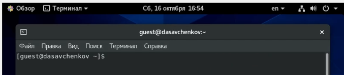
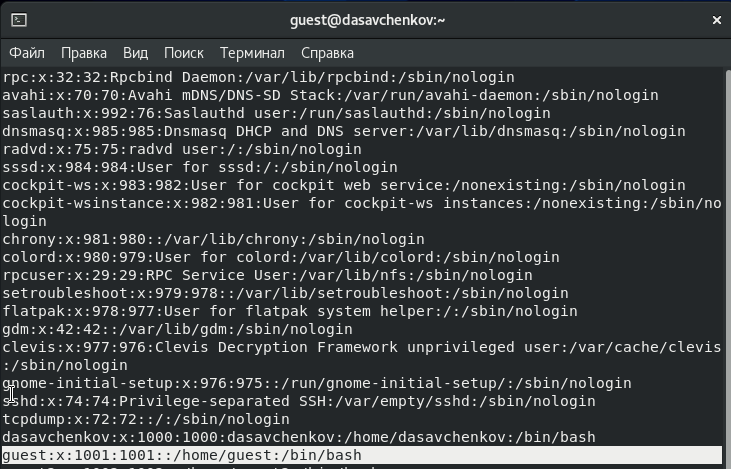
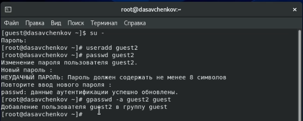
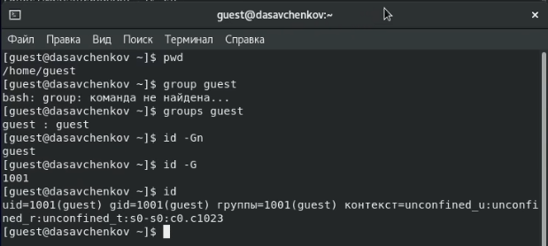
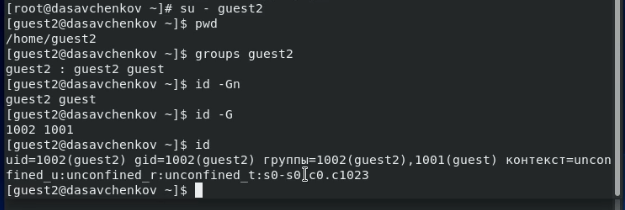
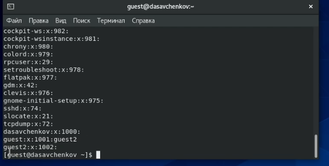
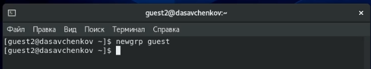
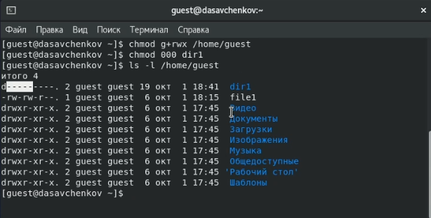

---
# Front matter
title: "Отчет по лабораторной работе 3"
subtitle: "Дисциплина: Информационная безопасность"
author: "Савченков Дмитрий Андреевич, НПИбд-02-18"

# Generic otions
lang: ru-RU
toc-title: "Содержание"

# Bibliography
bibliography: bib/cite.bib
csl: pandoc/csl/gost-r-7-0-5-2008-numeric.csl

# Pdf output format
toc: true # Table of contents
toc_depth: 2
lof: true # List of figures
lot: true # List of tables
fontsize: 12pt
linestretch: 1.5
papersize: a4
documentclass: scrreprt
## I18n
polyglossia-lang:
  name: russian
  options:
	- spelling=modern
	- babelshorthands=true
polyglossia-otherlangs:
  name: english
### Fonts
mainfont: PT Serif
romanfont: PT Serif
sansfont: PT Sans
monofont: PT Mono
mainfontoptions: Ligatures=TeX
romanfontoptions: Ligatures=TeX
sansfontoptions: Ligatures=TeX,Scale=MatchLowercase
monofontoptions: Scale=MatchLowercase,Scale=0.9
## Biblatex
biblatex: true
biblio-style: "gost-numeric"
biblatexoptions:
  - parentracker=true
  - backend=biber
  - hyperref=auto
  - language=auto
  - autolang=other*
  - citestyle=gost-numeric
## Misc options
indent: true
header-includes:
  - \linepenalty=10 # the penalty added to the badness of each line within a paragraph (no associated penalty node) Increasing the value makes tex try to have fewer lines in the paragraph.
  - \interlinepenalty=0 # value of the penalty (node) added after each line of a paragraph.
  - \hyphenpenalty=50 # the penalty for line breaking at an automatically inserted hyphen
  - \exhyphenpenalty=50 # the penalty for line breaking at an explicit hyphen
  - \binoppenalty=700 # the penalty for breaking a line at a binary operator
  - \relpenalty=500 # the penalty for breaking a line at a relation
  - \clubpenalty=150 # extra penalty for breaking after first line of a paragraph
  - \widowpenalty=150 # extra penalty for breaking before last line of a paragraph
  - \displaywidowpenalty=50 # extra penalty for breaking before last line before a display math
  - \brokenpenalty=100 # extra penalty for page breaking after a hyphenated line
  - \predisplaypenalty=10000 # penalty for breaking before a display
  - \postdisplaypenalty=0 # penalty for breaking after a display
  - \floatingpenalty = 20000 # penalty for splitting an insertion (can only be split footnote in standard LaTeX)
  - \raggedbottom # or \flushbottom
  - \usepackage{float} # keep figures where there are in the text
  - \floatplacement{figure}{H} # keep figures where there are in the text
---

# Цель работы

Получение практических навыков работы в консоли с атрибутами файлов для групп пользователей.

# Выполнение лабораторной работы

1. В установленной операционной системе уже была создана учётная запись пользователя guest (рис. [-@fig:001] и [-@fig:002]). Поэтому сразу создал второго 
пользователя guest2 (используя учётную запись администратора): `useradd guest2` (рис. [-@fig:003]).

{ #fig:001 width=70% }

{ #fig:002 width=70% }

2. Задал пароль для пользователя guest2 (используя учётную запись администратора): `passwd guest2` (рис. [-@fig:003]).

3. Добавил пользователя guest2 в группу guest: `gpasswd -a guest2 guest` (рис. [-@fig:003]).

{ #fig:003 width=70% }

4. Осуществил вход в систему от двух пользователей на двух разных консолях: guest на первой консоли (рис. [-@fig:004]) и guest2 на второй консоли (рис. 
[-@fig:005]).

5. Для обоих пользователей командой pwd определил директорию, в которой нахожусь (рис. [-@fig:004] и [-@fig:005]). Она совпадает с приглашениями командной 
строки.

6. Уточнил имя своего пользователя, его группу, кто входит в неё и к каким группам принадлежит он сам с помощью команд `id -Gn` и `id -G`. Определил 
командами `groups guest` и `groups guest2`, в какие группы входят пользователи guest и guest2. (рис. [-@fig:004] и [-@fig:005]) Команды `groups` и `id -Gn` 
выводят одинаковую информацию: названия групп, в которых состоит пользователь, а команда `id -G` выводит id групп пользователя.

{ #fig:004 width=70% }

{ #fig:005 width=70% }

7. Просмотрел файл */etc/group* командой `cat /etc/group` (рис. [-@fig:006]). Содержимое этого файла совпадает с полученной ранее информацией.

{ #fig:006 width=70% }

8. От имени пользователя guest2 выполнил регистрацию пользователя guest2 в группе guest командой `newgrp guest` (рис. [-@fig:007]).

{ #fig:007 width=70% }

9. От имени пользователя guest изменил права директории */home/guest*, разрешив все действия для пользователей группы: `chmod g+rwx /home/guest` (рис. 
[-@fig:008]).

10. От имени пользователя guest снял с директории */home/guest/dir1* все атрибуты командой `chmod 000 dirl` и проверил правильность снятия атрибутов (рис. 
[-@fig:008]).

{ #fig:008 width=70% }

11. Меняя атрибуты у директории dir1 и файла file1 от имени пользователя guest и делая проверку от пользователя guest2, заполнил табл. "Установленные права 
и разрешенные действия для групп", определив опытным путём, какие операции разрешены, а какие нет (рис. [-@fig:009]-[-@fig:011]).

{ #fig:009 width=90% }

{ #fig:010 width=90% }

{ #fig:011 width=90% }

12. Сравнил табл. 2.1 (из лабораторной работы № 2) и табл. 3.1: различие в том, что даже при наличии у группы полных прав на директорию и на файл группа не 
может менять атрибуты файла.

13. На основании заполненной таблицы определил те или иные минимально необходимые права для выполнения пользователем guest2 операций внутри директории dir1 
и заполнил табл. "Минимальные права для совершения операций от имени пользователей, входящих в группу" (рис. [-@fig:012]).

{ #fig:012 width=70% }

# Выводы

Получил практические навыки работы в консоли с атрибутами файлов для групп пользователей.

# Список литературы{.unnumbered}

1. Кулябов Д. С., Королькова А. В., Геворкян М. Н. Информационная безопасность компьютерных сетей. Лабораторная работа № 3. Дискреционное разграничение прав 
в Linux. Два пользователя