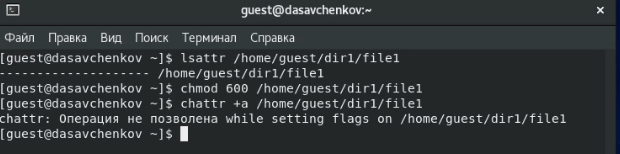
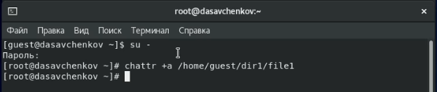
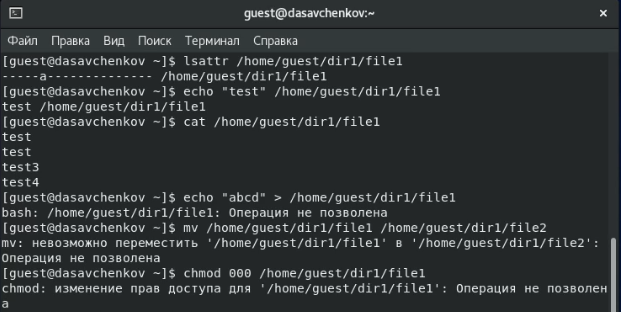
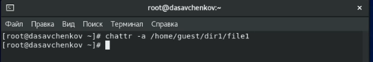
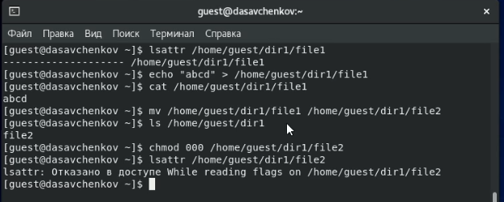
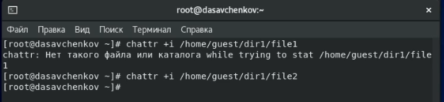
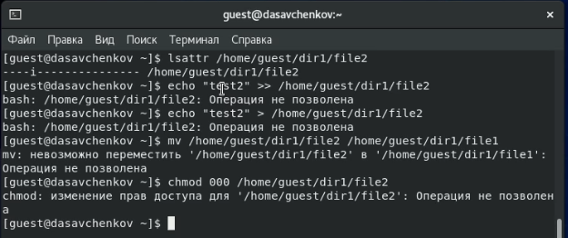

---
# Front matter
title: "Отчет по лабораторной работе 4"
subtitle: "Дисциплина: Информационная безопасность"
author: "Савченков Дмитрий Андреевич, НПИбд-02-18"

# Generic otions
lang: ru-RU
toc-title: "Содержание"

# Bibliography
bibliography: bib/cite.bib
csl: pandoc/csl/gost-r-7-0-5-2008-numeric.csl

# Pdf output format
toc: true # Table of contents
toc_depth: 2
lof: true # List of figures
lot: true # List of tables
fontsize: 12pt
linestretch: 1.5
papersize: a4
documentclass: scrreprt
## I18n
polyglossia-lang:
  name: russian
  options:
	- spelling=modern
	- babelshorthands=true
polyglossia-otherlangs:
  name: english
### Fonts
mainfont: PT Serif
romanfont: PT Serif
sansfont: PT Sans
monofont: PT Mono
mainfontoptions: Ligatures=TeX
romanfontoptions: Ligatures=TeX
sansfontoptions: Ligatures=TeX,Scale=MatchLowercase
monofontoptions: Scale=MatchLowercase,Scale=0.9
## Biblatex
biblatex: true
biblio-style: "gost-numeric"
biblatexoptions:
  - parentracker=true
  - backend=biber
  - hyperref=auto
  - language=auto
  - autolang=other*
  - citestyle=gost-numeric
## Misc options
indent: true
header-includes:
  - \linepenalty=10 # the penalty added to the badness of each line within a paragraph (no associated penalty node) Increasing the value makes tex try to have fewer lines in the paragraph.
  - \interlinepenalty=0 # value of the penalty (node) added after each line of a paragraph.
  - \hyphenpenalty=50 # the penalty for line breaking at an automatically inserted hyphen
  - \exhyphenpenalty=50 # the penalty for line breaking at an explicit hyphen
  - \binoppenalty=700 # the penalty for breaking a line at a binary operator
  - \relpenalty=500 # the penalty for breaking a line at a relation
  - \clubpenalty=150 # extra penalty for breaking after first line of a paragraph
  - \widowpenalty=150 # extra penalty for breaking before last line of a paragraph
  - \displaywidowpenalty=50 # extra penalty for breaking before last line before a display math
  - \brokenpenalty=100 # extra penalty for page breaking after a hyphenated line
  - \predisplaypenalty=10000 # penalty for breaking before a display
  - \postdisplaypenalty=0 # penalty for breaking after a display
  - \floatingpenalty = 20000 # penalty for splitting an insertion (can only be split footnote in standard LaTeX)
  - \raggedbottom # or \flushbottom
  - \usepackage{float} # keep figures where there are in the text
  - \floatplacement{figure}{H} # keep figures where there are in the text
---

# Цель работы

Получение практических навыков работы в консоли с расширенными атрибутами файлов.

# Выполнение лабораторной работы

1. От имени пользователя guest определил расширенные атрибуты файла */home/guest/dir1/file1* командой `lsattr /home/guest/dir1/file1`. (рис. [-@fig:001])

2. Установил командой `chmod 600 file1` на файл file1 права, разрешающие чтение и запись для владельца файла. (рис. [-@fig:001])

3. Попробовал установить на файл */home/guest/dir1/file1* расширенный атрибут *a* от имени пользователя guest: `chattr +a /home/guest/dir1/file1`. В ответ 
получил отказ в выполнении операции. (рис. [-@fig:001])

{ #fig:001 width=70% }

4. Зашел на вторую консоль и повысил свои права с помощью команды su. Попробовал установить расширенный атрибут *a* на файл */home/guest/dir1/file1* от 
имени суперпользователя: `chattr +a /home/guest/dir1/file1`. (рис. [-@fig:002])

{ #fig:002 width=70% }

5. От пользователя guest проверил правильность установления атрибута: `lsattr /home/guest/dir1/file1`. (рис. [-@fig:003])

6. Выполнил дозапись в файл file1 слова «test» командой `echo "test" >> /home/guest/dir1/file1`. После этого выполнил чтение файла file1 командой 
`cat /home/guest/dir1/file1`. Убедился, что слово test было успешно записано в file1. (рис. [-@fig:003])

7. Попробовал стереть имеющуюся в file1 информацию командой `echo "abcd" > /home/guest/dirl/file1`. Попробовал переименовать файл. (рис. [-@fig:003])

8. Попробовал с помощью команды `chmod 000 file1` установить на файл file1 права, запрещающие чтение и запись для владельца файла. (рис. [-@fig:003]) 
Указанные команды мне выполнить не удалось: операция была не позволена.

{ #fig:003 width=70% }

9. Снял расширенный атрибут *a* с файла */home/guest/dirl/file1* от имени суперпользователя командой `chattr -a /home/guest/dir1/file1`. (рис. [-@fig:004]) 

{ #fig:004 width=70% }

Повторил операции, которые мне ранее не удавалось выполнить. (рис. [-@fig:005]) Теперь все операции выполнены успешно.

{ #fig:005 width=70% }

10. Повторил свои действия по шагам (рис. [-@fig:007]), заменив атрибут *a* атрибутом *i* (рис. [-@fig:006]). Теперь мне не удалось даже дозаписать 
информацию в файл. Все остальные операции так же, как и ранее, не удались.

{ #fig:006 width=70% }

{ #fig:007 width=70% }

# Выводы

Получил практические навыки работы в консоли с расширенными атрибутами файлов. Опробовал действия на практике расширенных атрибутов «а» и «i».

# Список литературы{.unnumbered}

1. Кулябов Д. С., Королькова А. В., Геворкян М. Н. Информационная безопасность компьютерных сетей. Лабораторная работа № 4. Дискреционное разграничение прав 
в Linux. Расширенные атрибуты.