---
## Front matter
lang: ru-RU
title: "Отчет по лабораторной работе 6"
author: |
	Savchenkov Dmitriy Andreevich\inst{1}
institute: |
	\inst{1}RUDN University, Moscow, Russian Federation
date: 27 November, 2021 Moscow, Russian Federation

## Formatting
toc: false
slide_level: 2
theme: metropolis
header-includes: 
 - \metroset{progressbar=frametitle,sectionpage=progressbar,numbering=fraction}
 - '\makeatletter'
 - '\beamer@ignorenonframefalse'
 - '\makeatother'
aspectratio: 43
section-titles: true
---

# **Цель выполнения лабораторной работы**

## Цель

Развить навыки администрирования ОС Linux. Получить первое практическое знакомство с технологией SELinux1.
Проверить работу SELinx на практике совместно с веб-сервером Apache.

# **Результаты выполнения лабораторной работы**

# **Подготовка лабораторного стенда**

## Проверка веб-сервара Apache

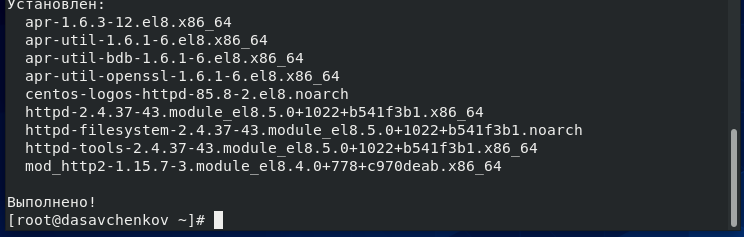{ #fig:001 width=45% }

## Изменение конфигурационного файла

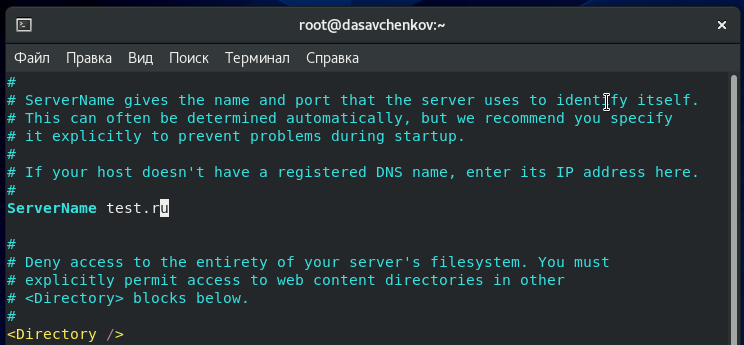{ #fig:002 width=90% }

## Разрещающие правила

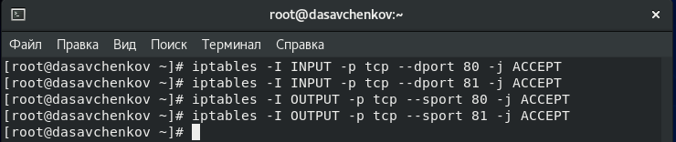{ #fig:003 width=90% }

# **Выполнение лабораторной работы**

## Проверка режима и политики SELinux

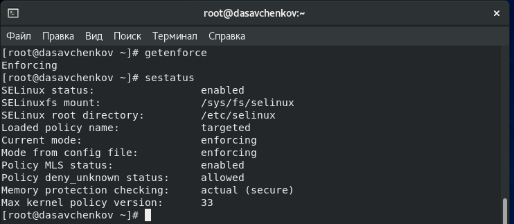{ #fig:004 width=90% }

## Проверка веб-сервера

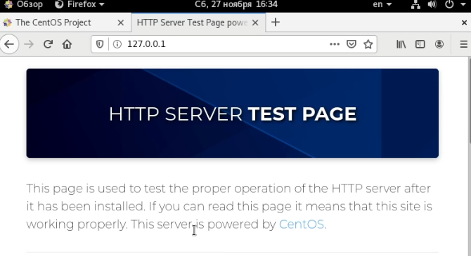{ #fig:005 width=70% }

## Просмотр состояний переключателей SELinux

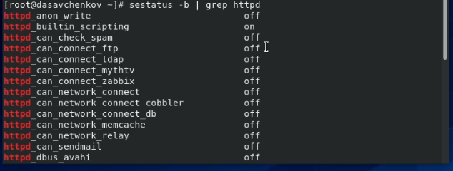{ #fig:006 width=70% }

## Статистика по политике с помощью команды *seinfo*

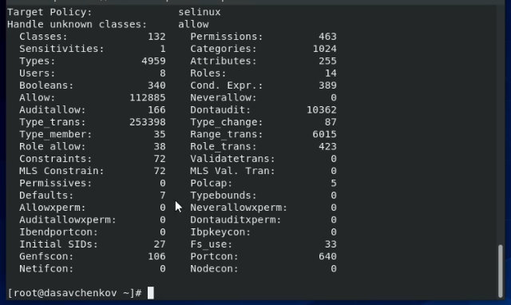{ #fig:007 width=70% }

## Создание файла *html* и проверка в браузере

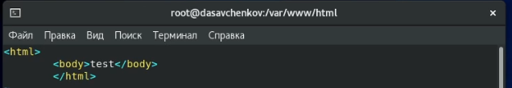{ #fig:008 width=70% }
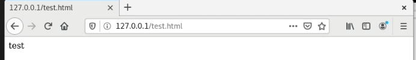{ #fig:009 width=70% }

## Изменение контекста файла и проверка в браузере

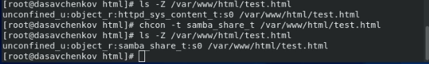{ #fig:010 width=70% }
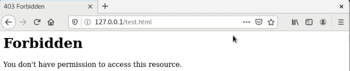{ #fig:011 width=70% }

## Замена порта

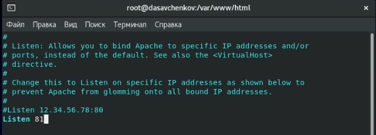{ #fig:012 width=70% }
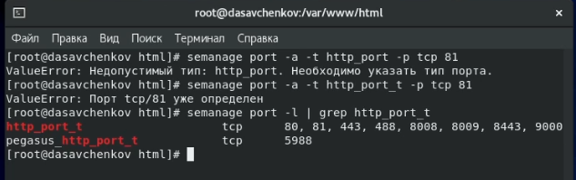{ #fig:013 width=70% }
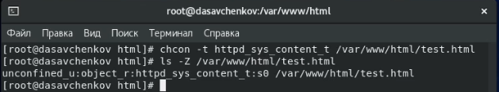{ #fig:014 width=70% }
{ #fig:015 width=70% }

## Завершение

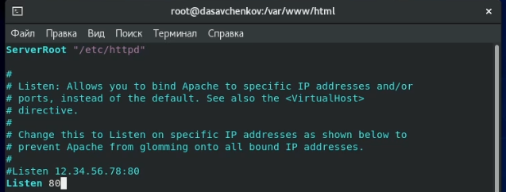{ #fig:016 width=70% }
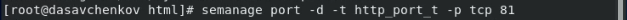{ #fig:017 width=70% }
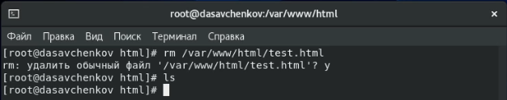{ #fig:018 width=70% }

# **Выводы по лабораторной работе**

## Выводы

Развил навыки администрирования ОС Linux. Получил первое практическое знакомство с технологией SELinux. Проверил работу SELinx на практике совместно с веб-сервером Apache.

## {.standout}

Спасибо за внимание!
