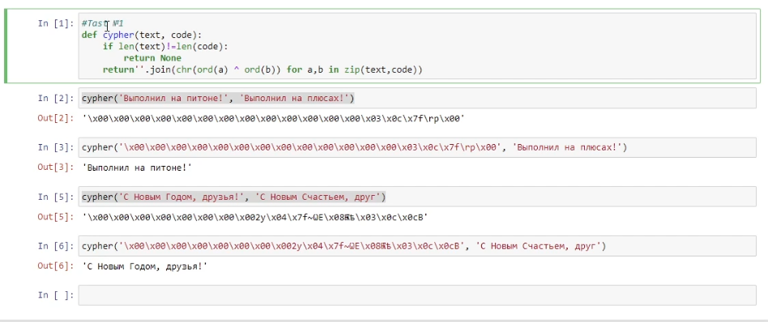
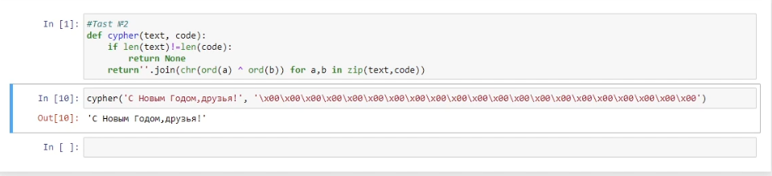

---
## Front matter
lang: ru-RU
title: "Отчет по лабораторной работе 7"
author: |
	Savchenkov Dmitriy Andreevich\inst{1}
institute: |
	\inst{1}RUDN University, Moscow, Russian Federation
date: 11 December, 2021 Moscow, Russian Federation

## Formatting
toc: false
slide_level: 2
theme: metropolis
header-includes: 
 - \metroset{progressbar=frametitle,sectionpage=progressbar,numbering=fraction}
 - '\makeatletter'
 - '\beamer@ignorenonframefalse'
 - '\makeatother'
aspectratio: 43
section-titles: true
---

# **Цель выполнения лабораторной работы**

## Цель

Освоить на практике применение режима однократного гаммирования.

# **Результаты выполнения лабораторной работы**

## Определил вид шифротекста при известном ключе

{ #fig:001 width=45% }

## Определил ключ, с помощью которого шифротекст может быть преобразован в некоторый фрагмент текста

{ #fig:002 width=90% }

# **Выводы по лабораторной работе**

## Выводы

Освоил на практике применение режима однократного гаммирования.

## {.standout}

Спасибо за внимание!
