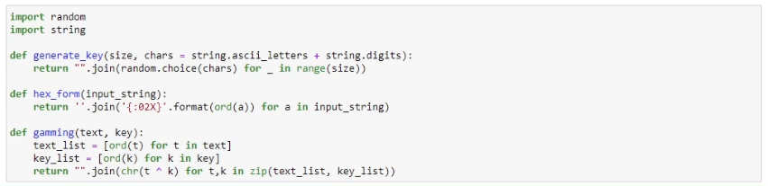
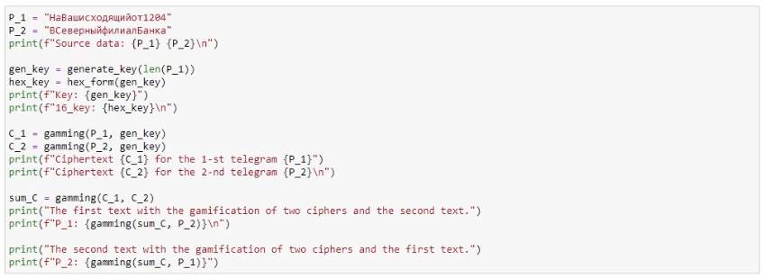
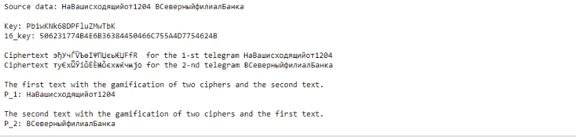

---
## Front matter
lang: ru-RU
title: "Отчет по лабораторной работе 8"
author: |
	Savchenkov Dmitriy Andreevich\inst{1}
institute: |
	\inst{1}RUDN University, Moscow, Russian Federation
date: 18 December, 2021 Moscow, Russian Federation

## Formatting
toc: false
slide_level: 2
theme: metropolis
header-includes: 
 - \metroset{progressbar=frametitle,sectionpage=progressbar,numbering=fraction}
 - '\makeatletter'
 - '\beamer@ignorenonframefalse'
 - '\makeatother'
aspectratio: 43
section-titles: true
---

# Цель выполнения работы

## Цель работы

Освоить на практике применение режима однократного гаммирования на примере кодирования различных исходных текстов одним ключом.

# Результаты выполненной работы

- Написал программу на языке программирования Python для выполнения данной лабораторной работы.
- Зашифровал две телеграммы одним ключом с помощью шифрования однократного гаммирования. С помощью формул C1 = P1 (+) K, C2 = P2 (+) K.
- Вывел открытый текст, зная шифротекст двух телеграмм и сумму C_1 и C_2 по модулю 2. C1 (+) C2

## Программа

{ #fig:001 width=70% height=70% }

## Программа

{ #fig:003 width=70% height=70% }

## Программа

{ #fig:004 width=70% height=70%}

# Выводы по работе

## Выводы

Освоил на практике применение режима однократного гаммирования на примере кодирования различных исходных текстов одним ключом.

## {.standout}

Спасибо за внимание!
