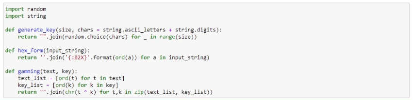
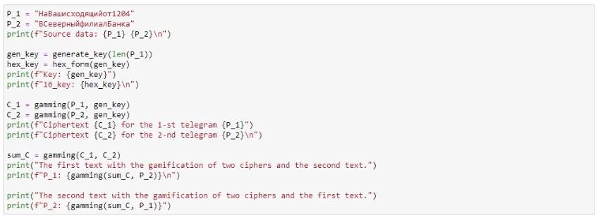
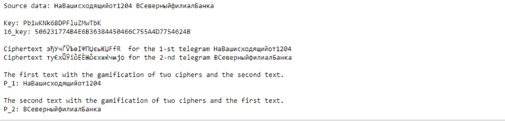

---
# Front matter
title: "Отчет по лабораторной работе 8"
subtitle: "Дисциплина: Информационная безопасность"
author: "Савченков Дмитрий Андреевич, НПИбд-02-18"

# Generic otions
lang: ru-RU
toc-title: "Содержание"

# Bibliography
bibliography: bib/cite.bib
csl: pandoc/csl/gost-r-7-0-5-2008-numeric.csl

# Pdf output format
toc: true # Table of contents
toc_depth: 2
lof: true # List of figures
lot: true # List of tables
fontsize: 12pt
linestretch: 1.5
papersize: a4
documentclass: scrreprt
## I18n
polyglossia-lang:
  name: russian
  options:
	- spelling=modern
	- babelshorthands=true
polyglossia-otherlangs:
  name: english
### Fonts
mainfont: PT Serif
romanfont: PT Serif
sansfont: PT Sans
monofont: PT Mono
mainfontoptions: Ligatures=TeX
romanfontoptions: Ligatures=TeX
sansfontoptions: Ligatures=TeX,Scale=MatchLowercase
monofontoptions: Scale=MatchLowercase,Scale=0.9
## Biblatex
biblatex: true
biblio-style: "gost-numeric"
biblatexoptions:
  - parentracker=true
  - backend=biber
  - hyperref=auto
  - language=auto
  - autolang=other*
  - citestyle=gost-numeric
## Misc options
indent: true
header-includes:
  - \linepenalty=10 # the penalty added to the badness of each line within a paragraph (no associated penalty node) Increasing the value makes tex try to have fewer lines in the paragraph.
  - \interlinepenalty=0 # value of the penalty (node) added after each line of a paragraph.
  - \hyphenpenalty=50 # the penalty for line breaking at an automatically inserted hyphen
  - \exhyphenpenalty=50 # the penalty for line breaking at an explicit hyphen
  - \binoppenalty=700 # the penalty for breaking a line at a binary operator
  - \relpenalty=500 # the penalty for breaking a line at a relation
  - \clubpenalty=150 # extra penalty for breaking after first line of a paragraph
  - \widowpenalty=150 # extra penalty for breaking before last line of a paragraph
  - \displaywidowpenalty=50 # extra penalty for breaking before last line before a display math
  - \brokenpenalty=100 # extra penalty for page breaking after a hyphenated line
  - \predisplaypenalty=10000 # penalty for breaking before a display
  - \postdisplaypenalty=0 # penalty for breaking after a display
  - \floatingpenalty = 20000 # penalty for splitting an insertion (can only be split footnote in standard LaTeX)
  - \raggedbottom # or \flushbottom
  - \usepackage{float} # keep figures where there are in the text
  - \floatplacement{figure}{H} # keep figures where there are in the text
---

# Цель работы

Освоить на практике применение режима однократного гаммирования на примере кодирования различных исходных текстов одним ключом.

# Выполнение лабораторной работы

1. Для выполнения данной лабораторной работы использовал язык программирования Python. Написал функции для последующей работы. (рис. -@fig:001)
   - Функция generate_key берет на вход размер строки (size) в виде целового числа  и строку символов с помощью которых мы будем генерировать ключ (в нашем случае мы будем использовать буквы английского алфавита и числа). А возвращает сгенерированный ключ в строковом формате (string).
   - Функция hex_form берет на вход строку и возвращает её 16-ный вид данной строки.
   - Функция gamming берет на вход строку и сгенерированный ключ. А возвращает зашифрованную строку методом однократного гаммирования.
  
{ #fig:001 width=70% height=70% }

2. Использовал функции выше для определения новых переменных для дальнейшей работы. (рис. -@fig:002)
   - Переменная P_1 - это исходная строка (телеграмма) из лабораторной работы "НаВашисходящийот1204"
   - Переменная P_2 - это исходная строка (телеграмма) из лабораторной работы "ВСеверныйфилиалБанка"
   - Переменная gen_key - это сгенерированный ключ, который мы получили из функции generate_key.
   - Переменная hex_key - это 16-ная форма сгенерированного ключа.
   - Переменная C_1 - это шифротекст для первой телеграммы P_1.
   - Переменная C_2 - это шифротекст для второй телеграммы P_2.
   - Переменная sum_C - это сумма шифротекстов по модулю 2.

{ #fig:002 width=70% height=70% }

3. Давайте изучим вывод программы. Вначале выводяться исходные телеграммы, ключ и его 16-ная форма. Затем выводиться шифротекст для двух исходных телеграмм, которые получены с помощью этой формулы C12 = P12 (+) K. В конце нам выводятся уже исходные телеграммы, которые получены с помощью суммирования C_1 и C_2 по модулю 2 и исходных телеграмм. (рис. -@fig:003)
 
{ #fig:003 width=70% height=70% }

# Выводы

Освоил на практике применение режима однократного гаммирования на примере кодирования различных исходных текстов одним ключом.

# Список литературы{.unnumbered}

1. Кулябов Д. С., Королькова А. В., Геворкян М. Н. Информационная безопасность компьютерных сетей. Лабораторная работа № 5. Дискреционное разграничение прав 
в Linux. Исследование влияния дополнительных атрибутов